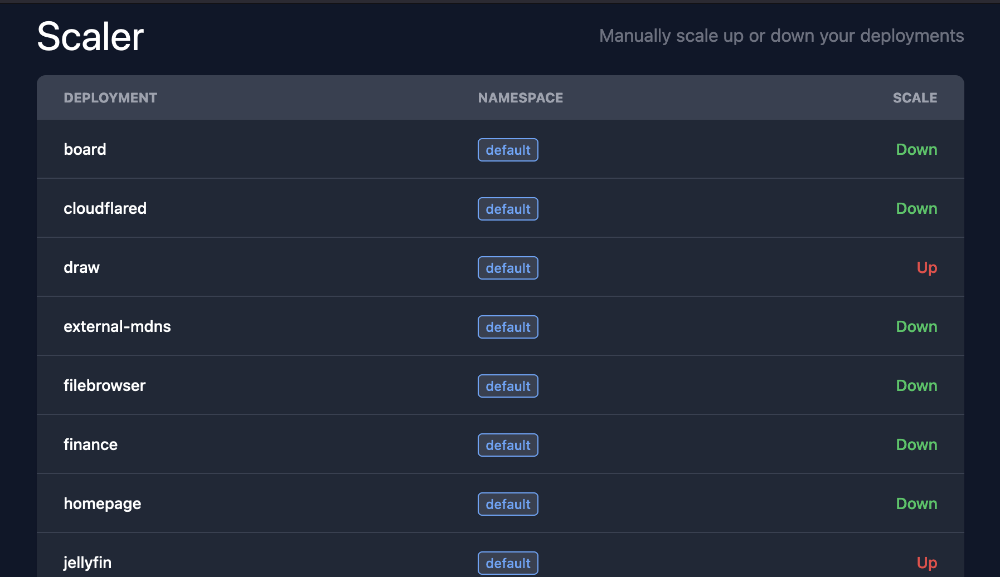
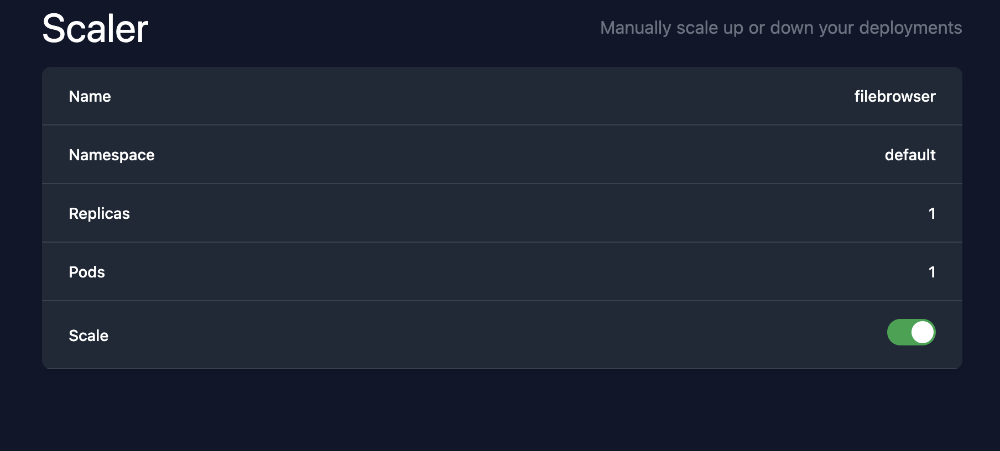

# scaler

Manually scale up or down your deployments

## Requirements

- access to kubeconfig (locally) or service account (in cluster)
- deployments must have annotation `scaler.reyel.cloud/enabled: "true"`


## Usage

Deploy the following manifest

```yaml
---
apiVersion: v1
kind: ServiceAccount
metadata:
  name: scaler
  namespace: default

---
apiVersion: rbac.authorization.k8s.io/v1
kind: ClusterRole
metadata:
  name: scaler-role
  namespace: default
rules:
  - apiGroups: ["apps"]
    resources: ["deployments"]
    verbs: ["get", "list", "update"]

---
apiVersion: rbac.authorization.k8s.io/v1
kind: ClusterRoleBinding
metadata:
  name: scaler-binding
  namespace: default
roleRef:
  apiGroup: rbac.authorization.k8s.io
  kind: ClusterRole
  name: scaler-role
subjects:
  - kind: ServiceAccount
    name: scaler
    namespace: default

---
apiVersion: apps/v1
kind: Deployment
metadata:
  name: scaler
spec:
  strategy:
    type: Recreate
  selector:
    matchLabels:
      app: scaler
  template:
    metadata:
      labels:
        app: scaler
    spec:
      serviceAccountName: scaler
      containers:
      - name: scaler
        image: ghcr.io/felipereyel/k8s-manual-scaler:latest
        env:
        - name: USE_SA
          value: "true"
        - name: PORT
          value: "3000"

```

## Screens

### Home


### Details

